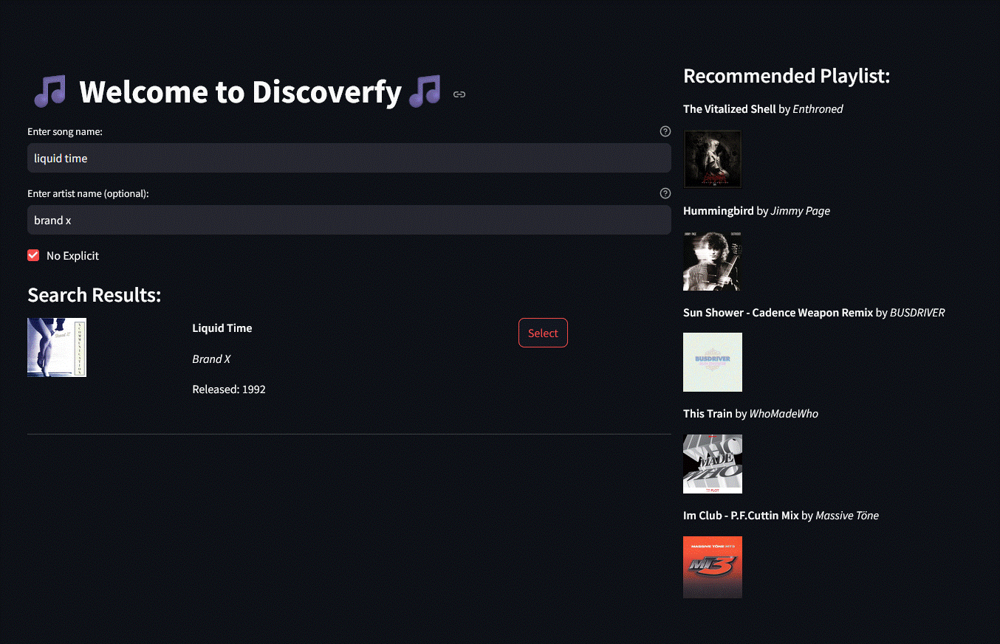

# Discoverfy Readme Guide

### What's Discoverfy?

DiscoverTrack is a music recommendation app designed to help users explore new songs tailored to their tastes. By leveraging the Spotify API, the app retrieves data of a song a user enjoys. These features are then analyzed using a KMeans clustering model which groups songs based on their similarity in musical attributes.

When a user inputs a song they like, the app identifies its cluster and recommends other songs within the same group, ensuring that the suggestions align with the user’s preferences. The app's sleek interface allows users to preview songs, save them to playlists, or explore related genres effortlessly. Users can also opt to not show results with explicit constant.

With its blend of machine learning and Spotify's vast music library, **DiscoverTunes** offers a personalized and engaging way for users to discover hidden gems and expand their musical horizons, making it a must-have for music enthusiasts everywhere.

### Screenshot

 

### Link to App

TBD

### Resources

### File Structure

song-recommender/
├── .venv/
├── .gitignore
├── .streamlit/
│   └── config.toml
└── data/
    ├──
    ├── 2_million_song_subset_raw.csv
    ├── 3_combined_clean_dataset.csv
    ├── 4_sp_songs.csv
    ├── 5_sp_audio_features.csv
    ├── 6_sp_combined_dataset.csv
    └── 7_clustered_dataset.csv
└── notebooks/
    ├── 1_data_collection.ipynb
    ├── 2_data_processing.ipynb
    ├── 3_spotify_api_extension.ipynb
    ├── 4_modeling_evaluation.ipynb
    └── 5_recommender_test.ipynb
└── models/
    ├── kmeans_1.pkl
    ├── dbscan_1.pkl
    ├── ...
└── scaler/
	  ├── scaler.pkl
└── utils/
		├── functions.py
└── app/
    ├── recommender_app.py
    └── requirements.txt
└── README.md

### Steps to Run the App Locally

1. clone repo
2. pip install requirements.txt
3. update .env with Spotify API credentials
4. streamlit run command
