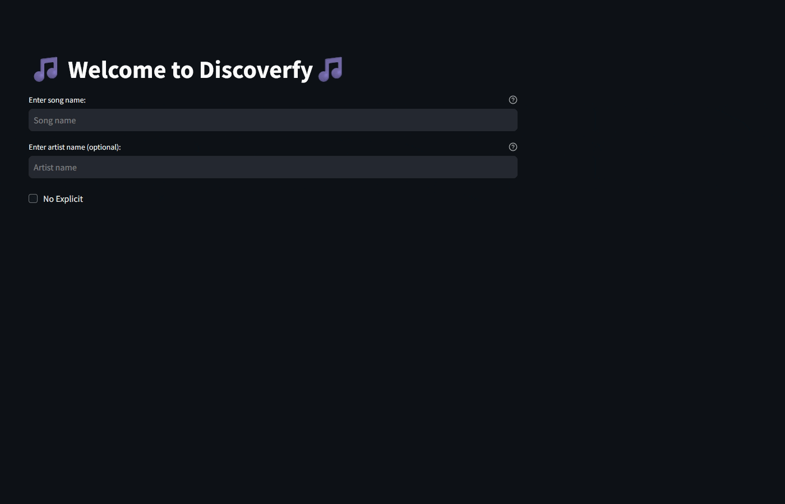

# Discoverfy Readme Guide

<<<<<<< HEAD
### What's Discoverfy?
=======
 

## What's Discoverfy?
>>>>>>> e1f5d372d18039ca0c5cf6ef97bba97fde464cda

DiscoverTrack is a music recommendation app designed to help users explore new songs tailored to their tastes. By leveraging the Spotify API, the app retrieves data of a song a user enjoys. These features are then analyzed using a KMeans clustering model which groups songs based on their similarity in musical attributes.

When a user inputs a song they like, the app identifies its cluster and recommends other songs within the same group, ensuring that the suggestions align with the user’s preferences. The app's sleek interface allows users to preview songs, save them to playlists, or explore related genres effortlessly. Users can also opt to not show results with explicit constant.

With its blend of machine learning and Spotify's vast music library, **DiscoverTunes** offers a personalized and engaging way for users to discover hidden gems and expand their musical horizons, making it a must-have for music enthusiasts everywhere.

<<<<<<< HEAD
### Screenshot


### Link to App

TBD

### Resources

### File Structure

=======
## Link to App

TBD

## Resources

- **Billbord Hot 100 List**: [Billboard Hot 100](https://www.billboard.com/charts/hot-100/)
- **Spotify API**: [Spotify Developer](https://developer.spotify.com/documentation/web-api/)
- **Million Song Dataset (Subset)**: [Million Song Dataset](http://millionsongdataset.com/)

## File Structure
```
>>>>>>> e1f5d372d18039ca0c5cf6ef97bba97fde464cda
song-recommender/
├── .venv/
├── .gitignore
├── .streamlit/
│   └── config.toml
└── data/
<<<<<<< HEAD
    ├──
=======
    ├── 1_hot_100_scraping.csv
>>>>>>> e1f5d372d18039ca0c5cf6ef97bba97fde464cda
    ├── 2_million_song_subset_raw.csv
    ├── 3_combined_clean_dataset.csv
    ├── 4_sp_songs.csv
    ├── 5_sp_audio_features.csv
    ├── 6_sp_combined_dataset.csv
    └── 7_clustered_dataset.csv
└── notebooks/
    ├── 1_data_collection.ipynb
    ├── 2_data_processing.ipynb
    ├── 3_spotify_api_extension.ipynb
    ├── 4_modeling_evaluation.ipynb
    └── 5_recommender_test.ipynb
└── models/
    ├── kmeans_1.pkl
<<<<<<< HEAD
    ├── dbscan_1.pkl
    ├── ...
└── scaler/
	  ├── scaler.pkl
└── utils/
		├── functions.py
└── app/
    ├── recommender_app.py
    └── requirements.txt
└── README.md

### Steps to Run the App Locally

1. clone repo
2. pip install requirements.txt
3. update .env with Spotify API credentials
4. streamlit run command
=======
    ├── ...
└── scaler/
	├── scaler.pkl
└── utils/
	├── functions.py
└── app/
    ├── app.py
    └── requirements.txt
└── README.md
```

## Steps to Run the App Locally
1. **Clone the Repository**
   ```bash
   git clone https://github.com/mjpacko/song-recommender
   cd song-recommender
   ```

2. **Install Requirements**
   ```bash
   pip install -r requirements.txt
   ```

3. **Update Environment Variables**
   - Create a `.env` file in the root directory and add your Spotify API credentials:
     ```
     SPOTIPY_CLIENT_ID=your_client_id
     SPOTIPY_CLIENT_SECRET=your_client_secret
     ```

4. **Run the App**
   ```bash
   streamlit run app/app.py
   ```

Enjoy discovering new music with Discoverfy!
>>>>>>> e1f5d372d18039ca0c5cf6ef97bba97fde464cda
